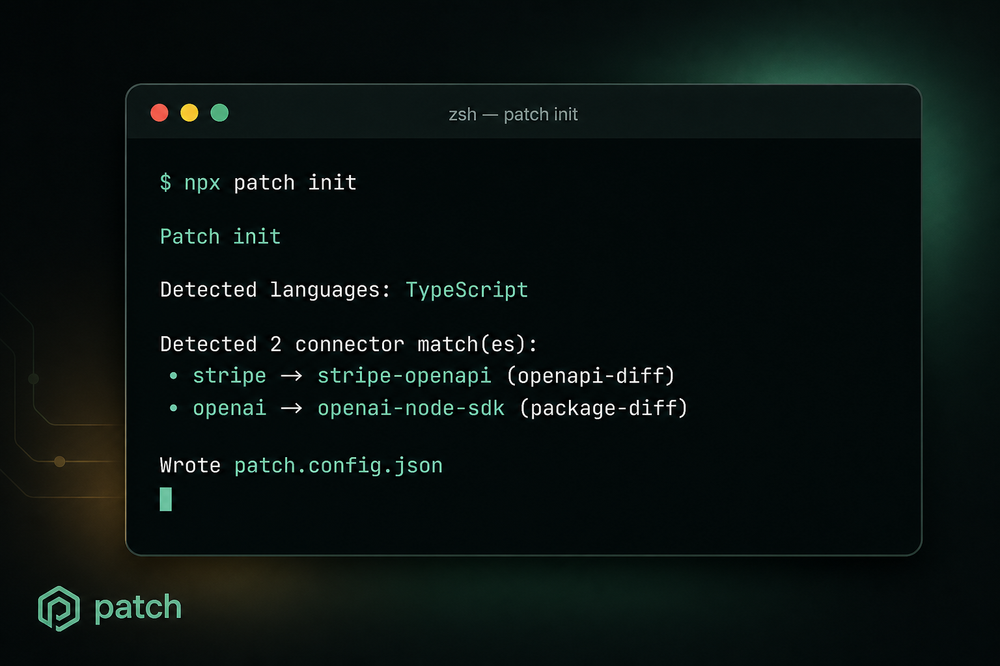
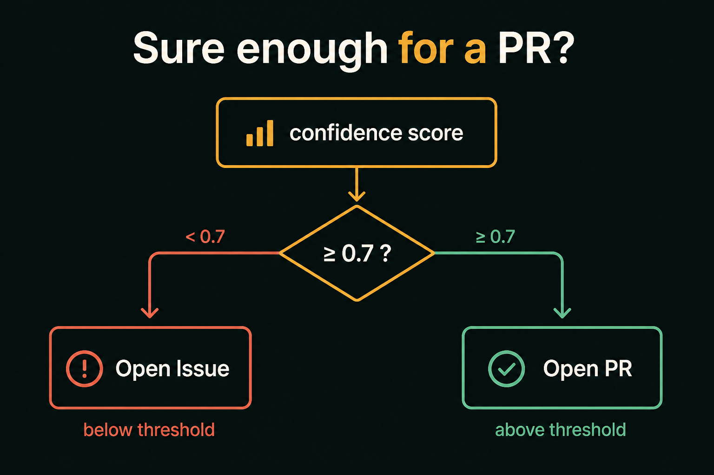
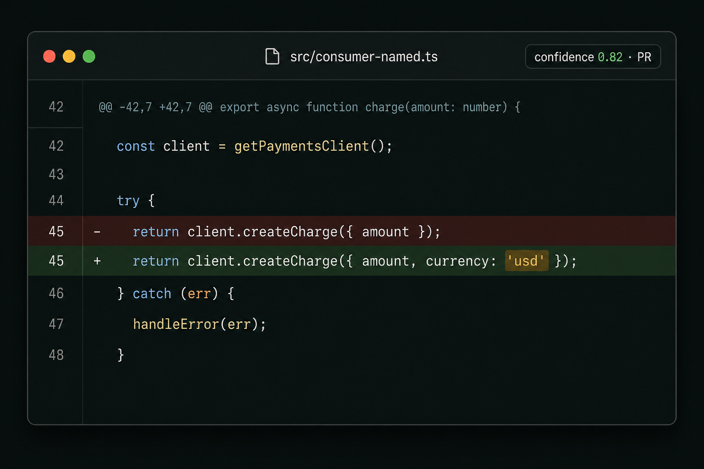

# Demo assets

## Video

- [`patch-demo.mp4`](./patch-demo.mp4) — ~40s silent product explainer (H.264 Main / yuv420p).

Rebuild from Remotion:

```bash
cd demos/video
pnpm install --ignore-workspace
pnpm render
cp out/patch-demo.mp4 ../../docs/demo/patch-demo.mp4
```

## Stills

| Asset | What it shows |
|-------|----------------|
| [`init-terminal.png`](./init-terminal.png) / [`.svg`](./init-terminal.svg) | `npx patch init` auto-detecting languages + API connectors |
| [`confidence-flow.png`](./confidence-flow.png) / [`.svg`](./confidence-flow.svg) | Confidence gate → **PR** (≥ 0.7) vs **Issue** (&lt; 0.7) |
| [`fix-diff.png`](./fix-diff.png) / [`.svg`](./fix-diff.svg) | Before/after fix adding required `currency` to `createCharge` |

### Preview

**Init**



**Confidence gate**



**Fix diff**


